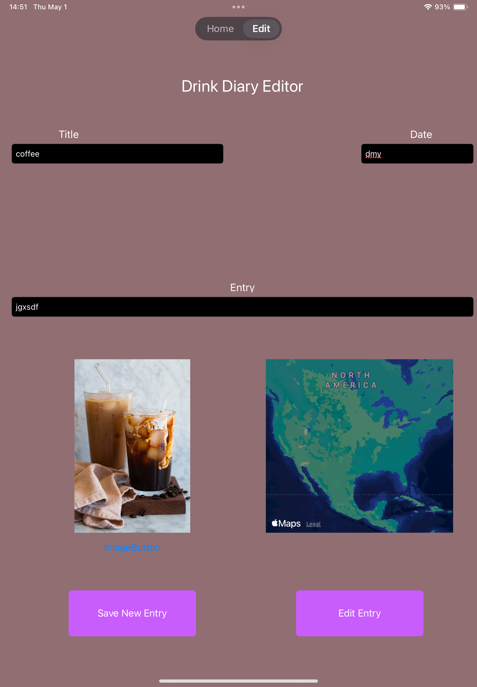
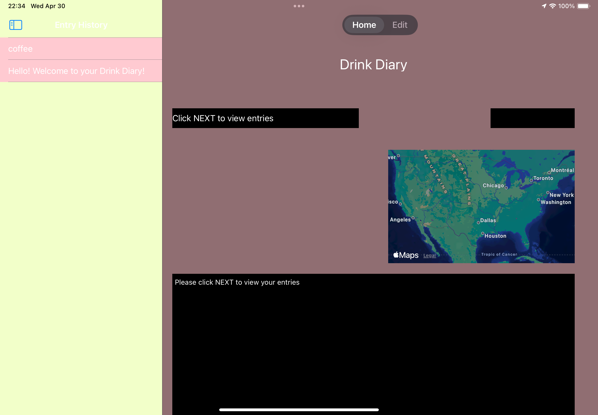

# DrinkDairy-iOS
Location-aware iOS drink tracking application built with UIKit, CoreLocation, MapKit, Image Uploads, and persistent storage.

DrinkDiary 📍☕️
DrinkDiary is a location-aware iOS application that allows users to log drinks from cafés, attach photos, and automatically capture the location of each entry using CoreLocation.
Users can revisit their drink history and rediscover cafés they enjoyed through an integrated MapKit view.

✨ Features
Add drink entries with title, date, and description
Attach photos using UIImagePickerController
Automatically capture café coordinates using CoreLocation
Display saved locations using MapKit
Edit existing entries
Persistent local data storage
Multi-screen navigation using SplitViewController and TabBarController

🛠 Technologies Used
Swift
UIKit (Storyboard-based UI)
CoreLocation
MapKit
UIImagePickerController
MVC Architecture
Delegate Pattern

🏗 Architecture Overview
The application follows the Model–View–Controller (MVC) pattern.
Model: Manages drink entries, images, and stored coordinates
View: Storyboard-based interface components
Controller: Handles user interaction, image selection, and location updates
Location data is captured through CLLocationManager and stored alongside each drink entry.
MapKit is used to visually display saved café coordinates.
A custom image picker implementation handles media selection using delegation.

## 📸 Screenshots

### Edit Drink Screen

### History + Map View

